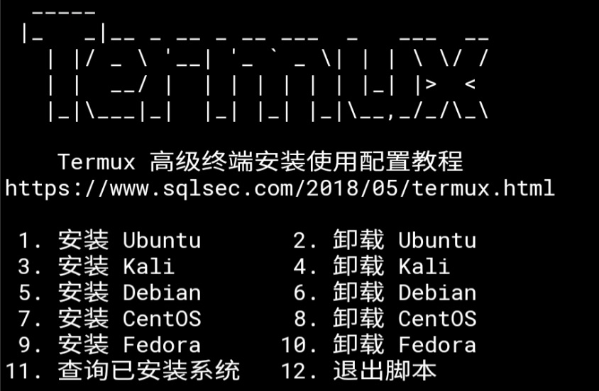
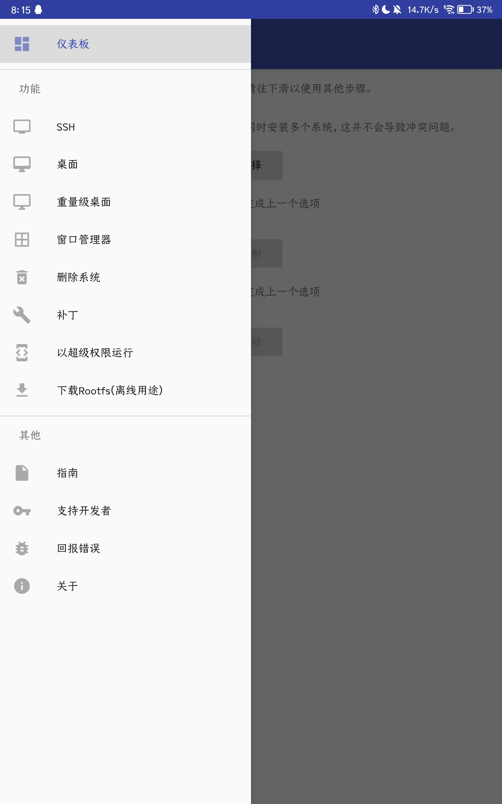
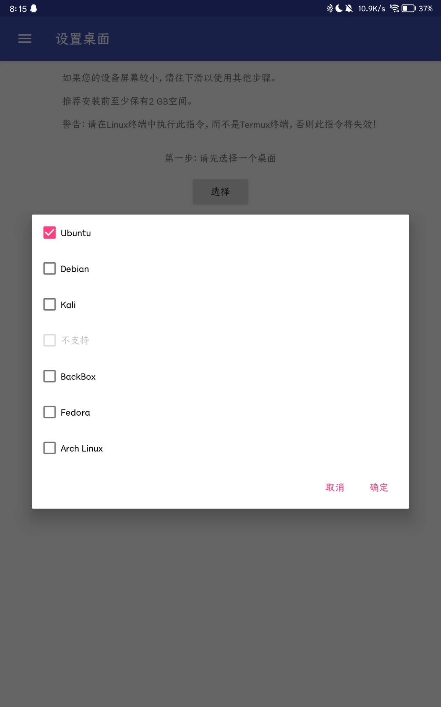
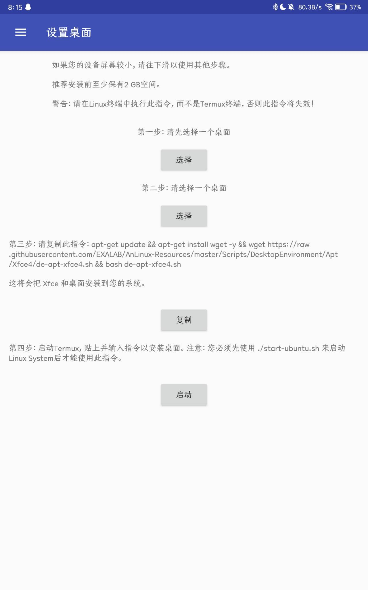
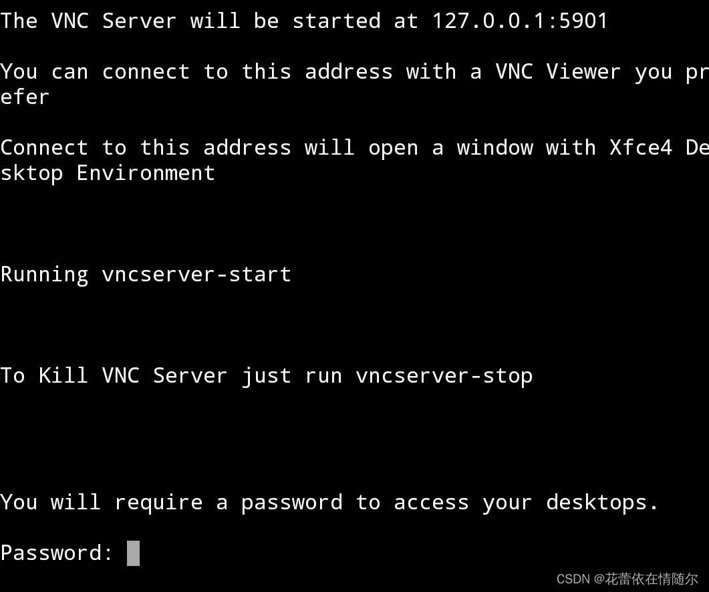
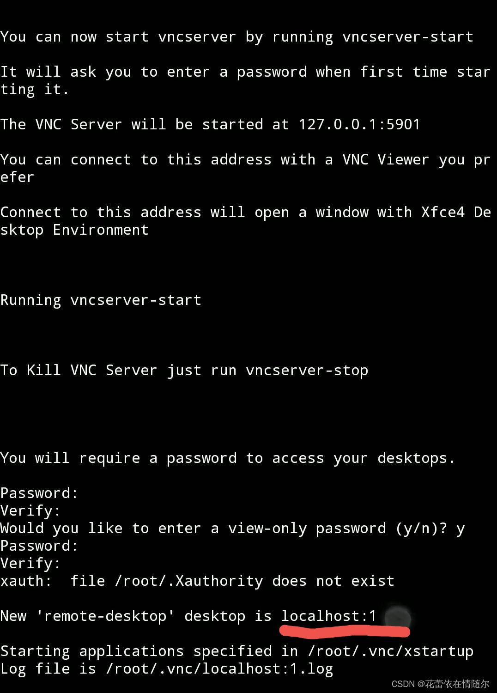
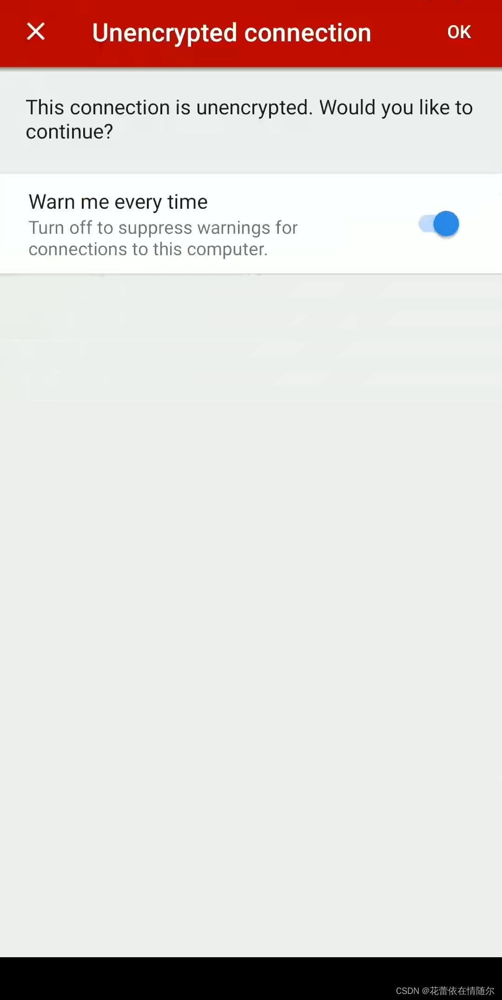
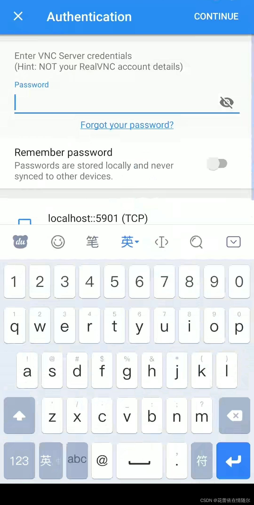

# 通过Termux在安卓上安装图形化Ubuntu界面

## 1.准备工作
需要的软件(都在安卓下):

[Termux](https://termux.dev/en/)

[AnLinux](https://github.com/EXALAB/AnLinux-App)

[Vnc Viewer](https://www.realvnc.com/en/connect/download/viewer/)

## 2.安装Ubuntu

Termux 安装好 proot 后可以运行 Linux 系统，利用国光的Termux 一键安装 Linux 脚本安装 Ubuntu。

首先安装依赖：

```
pkg install proot git python -y
```

下载脚本：

```
git clone https://github.com/sqlsec/termux-install-linux
```
下载完成后进入目录：
```
cd termux-install-linux
```
执行脚本：
```
python termux-linux-install.py
```
出现以下界面：



输入 ```1``` 安装 *Ubuntu*

---
## 3.安装桌面
安装完成后，依次执行下面的命令，进入 Ubuntu:
```
cd ~/Termux-Linux/Ubuntu
```
```
./start-ubuntu.sh
```

### 打开**Anlinux**
点击左侧边栏

选择 **桌面** 或 **重量级桌面（不推荐重量级桌面，占用性能大且有BUG）**



### 选择Ubuntu



### 选择你想安装的图形化界面（推荐Xfce4）


## 复制指令，回到Termux粘贴



粘贴后会自动安装图形化界面

---

安装过程中会出现选择语言的界面，选择Chinese即可

最后会出现设置输入桌面系统密码，该密码用于连接VNC Viewer软件，按照提示会输入四次

---
## 3.启动VNCServer
当出现下面的内容时，表明安装成功，VNCServer已启动



### 但此时可能会出现黑屏BUG


先输入命令停止当前server：
```
vncserver -kill :*
```
安装vim以编辑文件
```
apt install vim
```

打开启动文件
```
vim ~/.vnc/xstartup
```

按 ```i``` 键进入编辑

删除其中所有内容，修改其中的内容如下：
```
#!/bin/sh
 
export XKL_XMODMAP_DISABLE=1
unset SESSION_MANAGER
unset DBUS_SESSION_BUS_ADDRESS
 
xfce4-panel &
xfsettingsd &
xfwm4 &
xfdesktop &
pcmanfm &
xfce4-terminal &
```
按 ```Esc``` ，依次输入``` : w q``` 

此时退出文件编辑

最后输入：
```
vncserver-start
```
启动VncServer后，生成的 ```localhost:1``` 是VNC Viewer软件连接Ubuntu桌面系统的地址：


## 4.打开Vnc Viewer
按照软件提示一直点 Next，直到进入软件

在软件界面点击绿圈的+号

然后出现该界面


输入 生成的 ```localhost:1(输入自己所生成的)``` 和 ```名字(任意取)```

点击 ```CREATE```

---


点击```CONNECT```

---



点击```OK```

---

### 接下来输入密码，点击记住密码，再点击右上角的继续


---

### 耐心等待链接...


### 大功告成！

---

## 5.退出与重新启动

### 退出

点击右上角的  叉号，即可退出VNC Viewer

但注意此时并未完全退出，需要在 Termux 的 linux 系统 （即root@localhost:~# 后 ）输入：
```
vncserver-stop
```
才可以彻底的退出VNC Viewer

**再输入**
```
exit
```
即可退出Ubuntu

---

### 再次进入

依次执行下面的命令，进入 Ubuntu:
```
cd ~/Termux-Linux/Ubuntu
```
```
./start-ubuntu.sh
```
然后启动vncsever服务：
```
vncserver-start
```
再次打开VNC Viewer 即可进入 Ubuntu 桌面化界面
