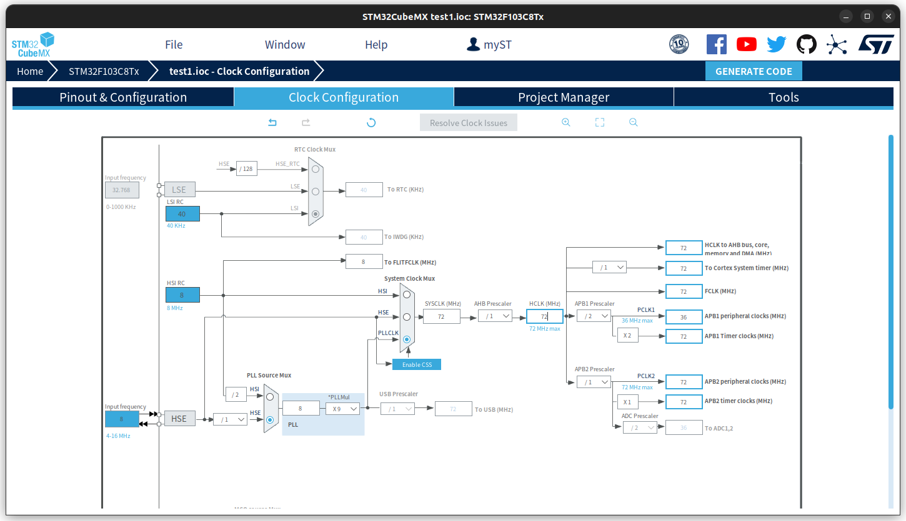
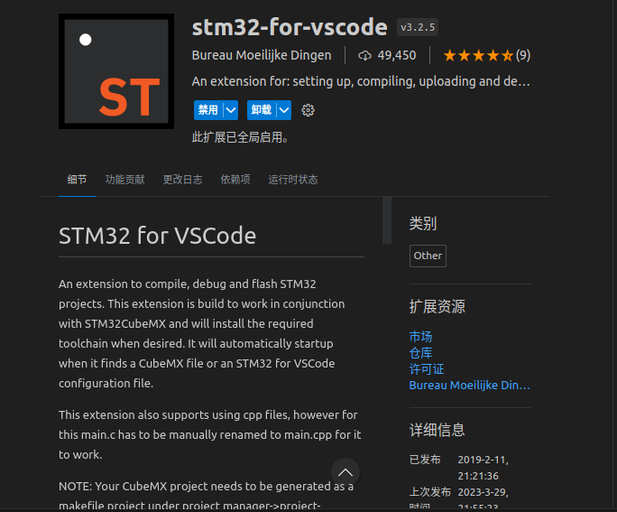
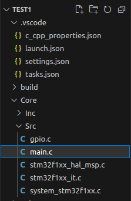
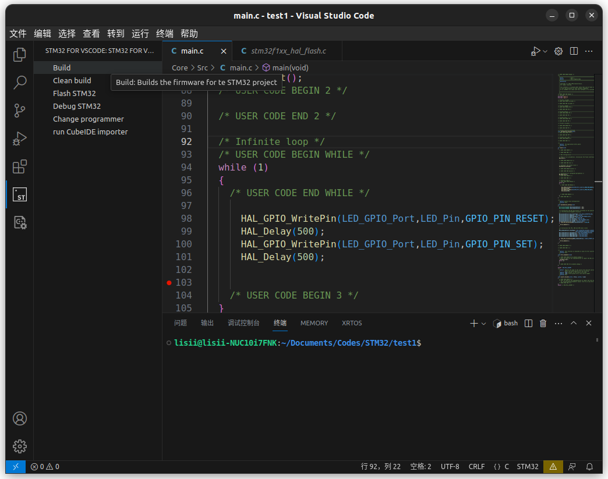
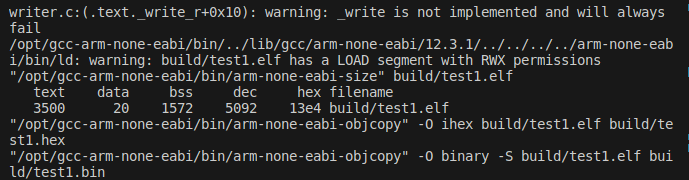

# Ubuntu下配置STM32开发环境(VSCode + STM32CubeMX)

## 1.工具准备
VSCode

STM32CubeMX

OpenOCD

gcc-arm-none-eabi编译器
## 2.步骤-以点亮板载LED为例
- ## OpenOCD配置

- （1）打开STM32CubeMX，单击FILE-New Project(或者图中选项)

- （2）弹出芯片选择界面，在Commercial搜索框输入F103C8T6右下方会自动出现STM32F103C8T6，点击选择，然后点Start Project

- （3）进入配置界面后单击System Core（系统核心） → SYS → Debug → Serial Wire（这个是调试模式，如果不选Serial Wire则可能会使得无法使用Stlink或Jlink下载，如果你是用串口线下载，不调试，不选也没关系）。

    （图片仅供示意，忽略右边的芯片设置）

- （4）单击System Core（系统核心） → RCC（配置晶振） → High speed Clock(HSE)（高速晶振）→ Crystal/Ceramic Resonator（外部晶振，8M）（如果这里选Disable则无法使用外部高速晶振）

    （图片仅供示意，忽略右边的芯片设置）

- （5）单击右边的PC13（因为板载LED灯接的PC13所以这里选PC13，可按照自己的要求自行设定） → GPIO_Output

    （图片仅供示意，右边的芯片设置同理）

- （6）设置好之后PC13变成绿色

- （7）单击Clock Configuration 

在这里输入72，按下回车 → OK，自动配置时钟频率为72Mhz

- （8）单击Project Manager → Project ，配置准备要生成的工程

    注意：这里IDE这一栏请选择MakeFile（因为我们用VSCode + cmake编写和调试）
    
- （9）单击Code Generator 单选Copy only the nacassary library files，勾选Generate peripheral…peripheral，上述的配置都设置好后就可以单击右上角的GENERATE CODE生成工程了。

- ## VSCode配置

- 用VSCode打开刚刚创建工程的文件夹

- 先安装拓展：stm32-for-vscode

- 依次打开工程结构树，双击main.c开始写源码

- 找到Drivers文件夹里的stm32f1xx_hal_gpio.c打开，找到第465行的HAL_GPIO_WritrPin函数，复制其函数名，并在main方法里的while(1)调用

- 开始build

- 没有报错，开始flash上去

- 板载LED亮

- ## 调试（待更新）